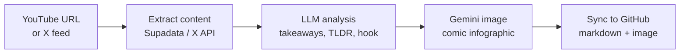

# mcp-content-pipeline

[](https://pypi.org/project/mcp-content-pipeline/)
[](https://pypi.org/project/mcp-content-pipeline/)
[](https://opensource.org/licenses/MIT)
[](https://pypi.org/project/mcp-content-pipeline/)

A content analysis and digest pipeline for YouTube videos and X (Twitter) feeds, exposed as [MCP](https://modelcontextprotocol.io/) tools: extract transcripts, fetch posts from curated accounts, generate key takeaways/TLDRs/social hooks/infographics, sync to GitHub.



## Role in ecosystem

- **Uses**: [mcp-llm-eval](https://github.com/berkayildi/mcp-llm-eval) for evaluation and CI quality gates
- **Produces**: benchmark JSON written to [llm-benchmarks](https://github.com/berkayildi/llm-benchmarks) under `text-generation/content-pipeline-*.json`
- **Visible at**: [LLMShot's Text Generation domain](https://llmshot.vercel.app/text-generation), Content Pipeline sub-benchmark

The eval dataset (`eval/dataset.json`) lives with this repo because the questions are specific to YouTube and X feed analysis — the dataset belongs with the use case, not the engine.

## Quick Start

```bash
uvx mcp-content-pipeline
```

Or install explicitly:

```bash
uv tool install mcp-content-pipeline
mcp-content-pipeline
```

### Claude Desktop Configuration

`server.py` loads `.env` directly from a path hardcoded at the top of the file — edit that path to match your clone, fill in `.env` (see `.env.example`), then add to `~/Library/Application Support/Claude/claude_desktop_config.json`:

```json
{
  "mcpServers": {
    "content-pipeline": {
      "command": "/usr/local/bin/uvx",
      "args": ["mcp-content-pipeline"]
    }
  }
}
```

No `env` block needed — all config comes from `.env`.

## Usage

**YouTube Analysis**

> "Use content-pipeline to analyse this video: https://www.youtube.com/watch?v=..."
> "Generate an image for this analysis"
> "Sync the analysis and image to GitHub"

Or all in one prompt:

> "Use content-pipeline to analyse this video, generate the image, and sync to GitHub: https://www.youtube.com/watch?v=..."

**X Feed Digest**

> "Analyse the X feed"
> "Analyse the X feed for karpathy, bcherny, atmoio, and steipete about AI today"
> "Analyse the X feed from the last 7 days"

Or with the full pipeline:

> "Analyse the X feed, generate the image, and sync to GitHub"

## Tools

| Tool                  | Description                                                               | Requires                                |
| --------------------- | ------------------------------------------------------------------------- | --------------------------------------- |
| `analyse_video`       | Analyse a single YouTube video — transcript, takeaways, TLDR, social hook | `PIPELINE_API_KEY`, `SUPADATA_API_KEY` |
| `batch_analyse`       | Analyse multiple videos from a URL list or config file                    | `PIPELINE_API_KEY`, `SUPADATA_API_KEY` |
| `list_channel_videos` | Fetch recent videos from a YouTube channel                                | `YOUTUBE_API_KEY`                       |
| `sync_to_github`      | Push analyses as markdown files to a GitHub repo                          | `GITHUB_TOKEN`, `GITHUB_REPO`           |
| `analyse_x_feed`      | Analyse recent posts from curated X accounts — daily digest               | `PIPELINE_API_KEY`, `X_BEARER_TOKEN`    |
| `generate_image`      | Generate comic-book infographic from analysis result                      | `GEMINI_API_KEY`                        |

## Environment Variables

All prefixed with `MCP_CP_`:

| Variable                       | Required        | Description                                                         |
| ------------------------------ | --------------- | ------------------------------------------------------------------- |
| `MCP_CP_PIPELINE_PROVIDER`     | No              | Text-analysis driver: `anthropic` \| `openai` \| `google` (default: `anthropic`) |
| `MCP_CP_PIPELINE_API_KEY`      | Yes             | API key for the selected provider above                             |
| `MCP_CP_PIPELINE_MODEL`        | No              | Model name valid for the selected provider (default: `claude-sonnet-4-6`) |
| `MCP_CP_SUPADATA_API_KEY`      | Yes for YouTube | Supadata API key for YouTube transcript extraction                  |
| `MCP_CP_YOUTUBE_API_KEY`       | No              | YouTube Data API v3 key (only for `list_channel_videos`)            |
| `MCP_CP_GITHUB_TOKEN`          | For sync        | GitHub personal access token                                        |
| `MCP_CP_GITHUB_REPO`           | For sync        | Target repo in `owner/repo` format                                  |
| `MCP_CP_GITHUB_BRANCH`         | No              | Branch to push to (default: `main`)                                 |
| `MCP_CP_GITHUB_OUTPUT_DIR`     | No              | Output directory for YouTube analyses (default: `content/youtube`)  |
| `MCP_CP_GITHUB_X_OUTPUT_DIR`   | No              | Output directory for X digests (default: `content/x-digest`)        |
| `MCP_CP_IMAGE_OUTPUT_DIR`      | No              | Directory for generated images (default: `~/Downloads`)             |
| `MCP_CP_MAX_TRANSCRIPT_TOKENS` | No              | Max transcript length in tokens (default: `100000`)                 |
| `MCP_CP_GEMINI_API_KEY`        | For image       | Google AI Studio API key for image generation                       |
| `MCP_CP_GEMINI_MODEL`          | No              | Gemini model for images (default: `gemini-3.1-flash-image-preview`) |
| `MCP_CP_X_BEARER_TOKEN`        | For X digest    | X API v2 bearer token                                               |
| `MCP_CP_X_ACCOUNTS`            | For X digest    | Comma-separated X usernames                                         |
| `MCP_CP_X_TOPICS`              | No              | Comma-separated topics (default: AI,tech)                           |

## Cost Projections

Estimated monthly costs for two usage patterns:

| Service                       | Daily (every day)       | Weekly X + daily YouTube |
| ----------------------------- | ----------------------- | ------------------------ |
| YouTube analysis (Claude API) | ~$3–5/mo (1 video/day)  | ~$3–5/mo (1 video/day)   |
| X feed digest (Claude API)    | ~$2–3/mo                | ~$0.50/mo                |
| Image generation (Gemini API) | ~$2/mo ($0.067/image)   | ~$2/mo ($0.067/image)    |
| X API reads                   | ~$4/mo ($0.13/day)      | ~$0.60/mo ($0.15/week)   |
| Supadata transcript API       | ~$0 (free tier: 100/mo) | ~$0 (free tier: 100/mo)  |
| **Total (excl. Claude API)**  | **~$6–9/mo**            | **~$3–5/mo**             |

> Claude API costs depend on your Anthropic billing plan and are not included in the totals above. If you already use Claude Pro ($20/mo), there is no additional Claude cost. The X API spending cap can be configured in the [developer console](https://developer.x.com/).

### What this replaces

| Subscription          | Monthly cost | What the pipeline covers instead                           |
| --------------------- | ------------ | ---------------------------------------------------------- |
| Google One AI Premium  | ~$20/mo     | Image generation via Gemini API (~$2/mo)                   |
| X Premium              | ~$8/mo      | X feed reading via API (~$0.60–4/mo)                       |
| YouTube Premium        | ~$14/mo     | Transcript extraction via Supadata (free tier)             |
| **Total saved**        | **~$42/mo** | **Pipeline cost: ~$3–9/mo** (plus your existing Claude plan) |

## Eval Gates

PRs touching system prompts or model config trigger a CI run via [mcp-llm-eval](https://github.com/berkayildi/mcp-llm-eval), scoring faithfulness/relevance across 8 models against a reference dataset; the PR is blocked below configured thresholds.

See `.eval-gate.yml` for threshold configuration and `eval/dataset.json` for the test dataset.

### Running benchmarks locally

The benchmark requires API keys for all providers. Create a `.env` file in the project root:

```
ANTHROPIC_API_KEY=sk-ant-...
OPENAI_API_KEY=sk-...
GOOGLE_API_KEY=AIza...
```

Then run:

```bash
make benchmark        # Run eval against all 8 models
make benchmark-copy   # Copy results to llm-benchmarks repo
```

Results are written to `eval/results/` (gitignored) and feed [LLMShot](https://llmshot.vercel.app) via the [llm-benchmarks](https://github.com/berkayildi/llm-benchmarks) repo (`text-generation/content-pipeline-{summary,benchmark}.json`).

[](https://pypi.org/project/mcp-llm-eval/) powers CI quality gates. The pipeline's own driver (`MCP_CP_PIPELINE_PROVIDER`) is configurable at runtime — see Environment Variables above.

## Development

```bash
git clone https://github.com/berkayildi/mcp-content-pipeline.git
cd mcp-content-pipeline
uv sync
uv run pytest -v --cov=src/mcp_content_pipeline
uv run ruff check src/ tests/
```

## Security

- Credentials live in a local `.env` (gitignored, see `.env.example`) or Claude Desktop config — never committed
- All API keys stay on your machine; nothing is sent anywhere but the configured providers

## Contributing

1. Fork the repository
2. Create a feature branch (`git checkout -b feat/my-feature`)
3. Commit using [Conventional Commits](https://www.conventionalcommits.org/) (`feat: add new feature`)
4. Push and open a Pull Request

## License

[MIT](LICENSE)
